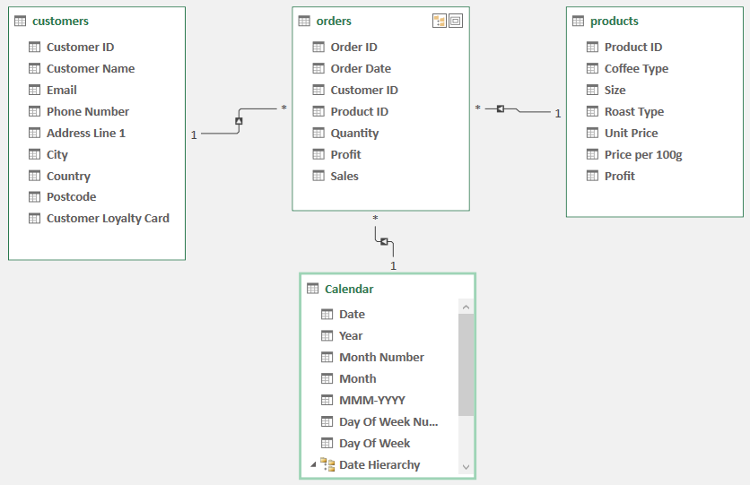
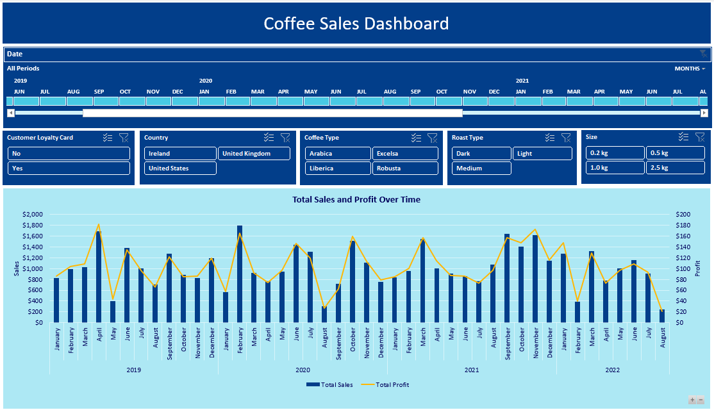
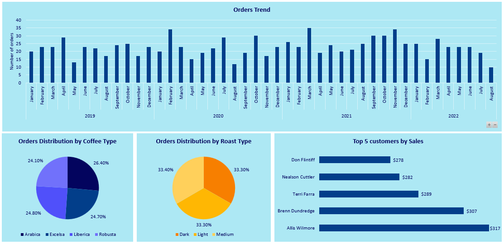

# Coffee Sales Dashboard

## Problematic Introduction
The business faced challenges in analyzing coffee sales performance due to disorganized data spread across multiple tables (orders, customers, products). This fragmentation limited the ability to gain clear insights into key metrics such as sales trends, profit margins, and customer loyalty. In addition, effective tracking of sales across various coffee types and roast types required a structured approach to optimize decision-making and enhance overall business performance. 

To address these challenges, several critical business questions needed to be answered:
- What are the sales and profit trends for coffee over time?
- How can we effectively track the overall orders trend?
- What insights can we gain regarding customer loyalty across different segments?
- How do sales and orders vary by coffee type and roast type?

## Solution Overview
To address these issues, I adopted a structured approach using Power Query for data import, Power Pivot for data modeling, and Pivot Tables for analysis, culminating in the development of an interactive dashboard. The process is summarized below:

1. **Data Import with Power Query**  
   I imported data from the CSV files presented in the data folder into Power Query for transformation. Key steps included cleaning the data, ensuring consistency across tables (orders, customers, products), and preparing the data for modeling.

2. **Data Modeling with Power Pivot**  
   In Power Pivot, I implemented a Star Schema for the data model. The orders table served as the fact table, while customers and products acted as dimension tables. To enable time-based analysis, I added a Date table using Power Pivot’s feature to create a calendar table, which is linked to the Order Date field in the orders table.
   

       
   

3. **Data Analysis: Pivot Tables**  
   Using Power Pivot, I created pivot tables to calculate key metrics such as:
   - **Sales and Profit Over Time**: Monitoring total sales and profit trends over specific periods.
   - **Orders Trend**: Visualizing the overall volume of orders placed over time.
   - **Orders by Coffee Type & Roast Type**: Breaking down orders by different coffee types and roast types.
   - **Top 5 Customers**: Identifying the most loyal customers based on their total purchases.

4. **Interactive Dashboard**  
   The final dashboard presents key insights through interactive charts, allowing users to drill down and filter the data. The dashboard includes:
   - **Slicer Timeline** for filtering by Order Dates.
   - Additional slicers for **Customer Loyalty**, **Customer Country**, **Coffee Type**, **Roast Type**, and **Size** to customize views based on specific business needs.
   

       
   

   

       
   

## Summary
This project enabled me to develop my skills in data cleaning, modeling, analysis, and visualization using Excel, utilizing Power Query, Power Pivot, and Pivot Tables to deliver comprehensive insights.
